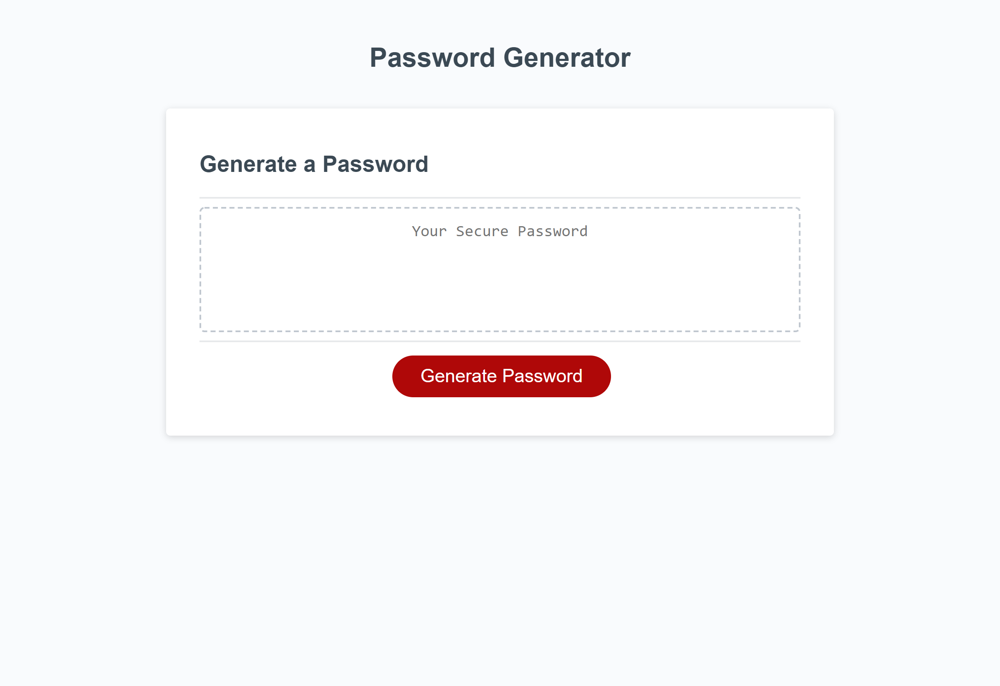

# Password Generator

Build an application that can generate random passwords based on the criterias that the user have chosen.

---

## Table of Content

- [How the Password Generator Works?](#function)
  - [Prompts](#prompt)
    - [Password Length](#pass-length)
    - [Types of Characters](#character-type)
  - [Creating the Password](#create-pass)
- [Screenshot](#screenshot)
- [Page Link](#page-link)

---

## How the Password Generator Works

The Password Generator gives prompts to the user to find out what they want in their password and utilizes that information to make the password.

### Prompts

There are two types of prompts given to the user which are asking for the password length and the types of character that are allowed to be used.

#### Password Length

The user is ask to pick a password length of between 8 to 128 characters. If the user picks a number not in the range or has an invalid, the prompt alert the user that they have made an invalid choose and will keep asking them until they picked a valid one.

#### Types of Characters

After the password length prompt, the application asks the user 4 prompts regarding the types of character to use. In order, the 4 prompts asks to use lowercase, uppercase, numeric, and special characters are allowed to be used. Additionally, the application is designed to ensure that at least one of the types of characters is used by giving an alert to the user if they have no characters to use and repeat the 4 prompt until one is allowed.

### Creating the Password

The application generates a random password that matches the information gotten from prompt by:

- using a array of valid characters that is empty at first and specific types of characters are added corresponding to the prompts that the user has answer that they wanted in their password
- randomly selecting a character from the array of valid characters one at a time until it password has a length the user has answered in the password length prompt

Additionally, the application ensures that at least one character from each allowed type of character is within the password by:

- guaranteeing that an index for each type of allowed character
- when the password generators get to that index, it will only choose a random character from the array of specific characters that index is reserved for

---

## Screenshot

---

## Page Link

Link: <a href="https://ptran77.github.io/password-generator/">https://ptran77.github.io/password-generator/</a>
